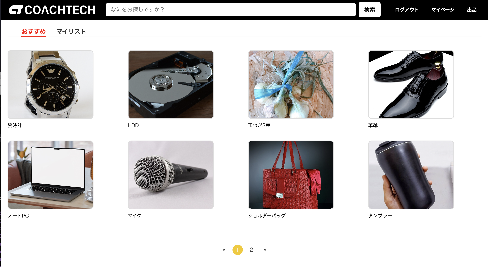
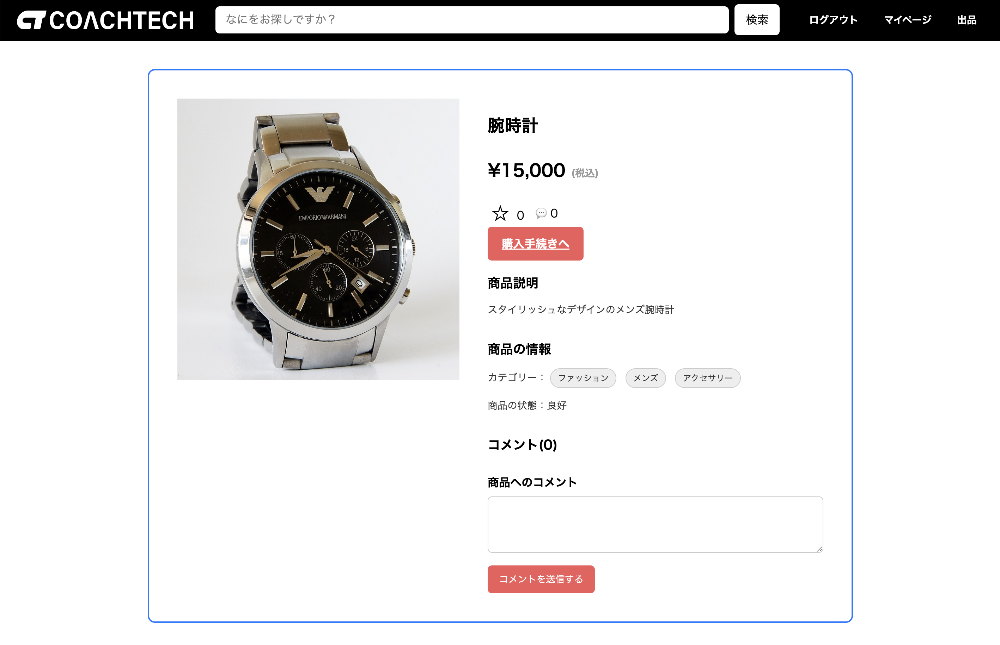
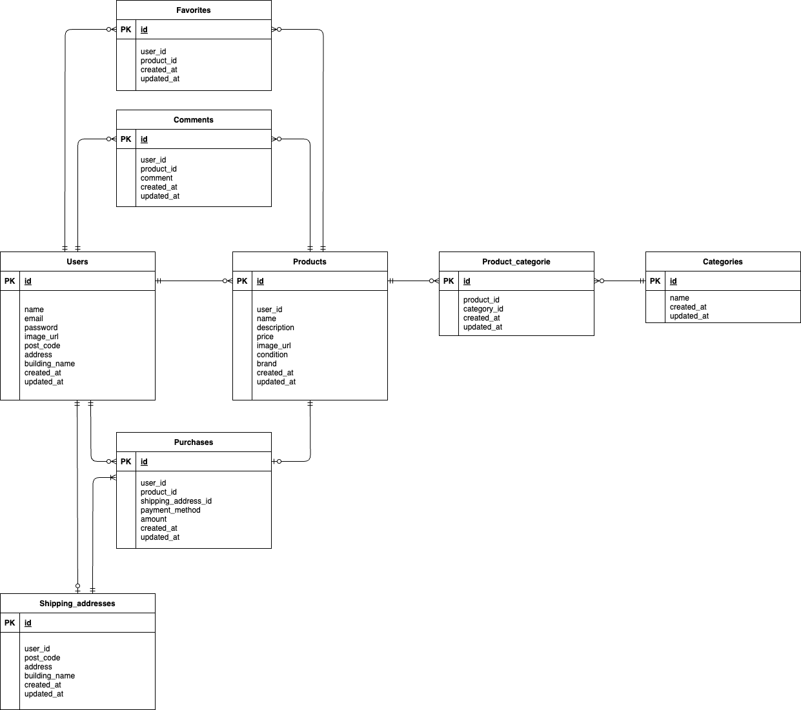

# お問い合わせフォーム

## 環境構築

### Docker ビルド

1.

```
git clone https://github.com/rrencanno/FreeMarket
```

2.

```
docker-compose up -d --build
```

> **Note**
> MySQL が環境によって正常に起動しない場合は、各 PC に合わせて`docker-compose.yml` ファイルを編集してください。

### Laravel 環境構築

1.

```
docker-compose exec php bash
```

2.

```
composer install
```

3.

```
cp .env.example .env
```

`.env` ファイルの環境変数を変更:

```
DB_CONNECTION=mysql
DB_HOST=mysql
DB_PORT=3306
DB_DATABASE=laravel_db
DB_USERNAME=laravel_user
DB_PASSWORD=laravel_pass
```

4.

```
php artisan key:generate
```

5.

```
php artisan migrate
```

※UnitTest を実行する場合

```
php artisan test
```

テストを実行した後は、以下のコマンドでシーディング作成をしてください。

```
php artisan migrate:fresh --seed
```

6. テストを行なっていた場合は、このステップは省略してください。

```
php artisan db:seed
```

7.

```
php artisan storage:link
```

## 使用技術 (実行環境)

- **PHP** 8.1.32
- **Laravel** 8.83.8
- **MySQL** 8.0.26

## ER 図



## URL

- **phpMyAdmin**：[http://localhost:8080](http://localhost:8080)
- **会員登録画面**：[http://localhost/register](http://localhost/register)
- **ログイン画面** : [http://localhost/login](http://localhost/login)
- **トップ画面** : [http://localhost/](http://localhost/)
