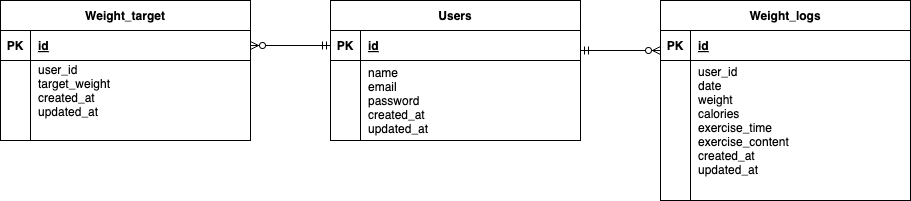

# お問い合わせフォーム

## 環境構築

### Docker ビルド

1. `git clone https://github.com/rrencanno/Pigly`
2. `docker-compose up -d --build`

> **Note**
> MySQL が環境によって正常に起動しない場合は、各 PC に合わせて`docker-compose.yml` ファイルを編集してください。

### Laravel 環境構築

1. `docker-compose exec php bash`
2. `composer install`
3. `cp .env.example .env`

    `.env` ファイルの環境変数を変更:

    ```
    ・12行目 → DB_HOST = mysql
    ・14行目 → DB_DATABASE = laravel_db
    ・15行目 → DB_USERNAME = laravel_user
    ・16行目 → DB_PASSWORD = laravel_pass
    ```

4. `php artisan key:generate`
5. `php artisan migrate`
6. `php artisan db:seed`
7. `php artisan storage:link`

## 使用技術 (実行環境)

- **PHP** 7.4.9
- **Laravel** 8.83.8
- **MySQL** 8.0.26

## ER 図
![ER図]



## URL

- **phpMyAdmin**：[http://localhost:8080](http://localhost:8080)
- **商品一覧画面**：[http://localhost/products](http://localhost/products)
